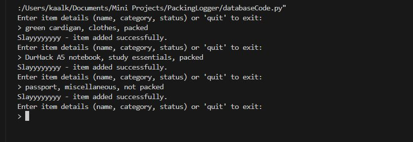
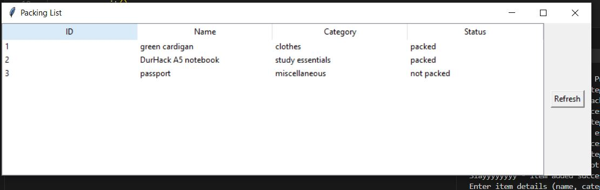

**MOTIVATION**

As the description for this repo says, I'm currently packing to go home for the Chrristmas holidays. 
I have a lot to pack and making an extensive list in the notes section of my phone is inefficient and unorganised.

This is a simple Python database (made using sqlite3) to log everything I'm packing. The system uses tkinter for a simple GUI (and threading to allow for terminal inputs while the GUI is running).

**VERSIONS**
Python 3.8+
SQLite3 module version: 2.6.0
SQLite database version: 3.43.1

**COMMANDS**

When running the file, the program has 3 options:

Insert:

  
   

Update:

Query:

