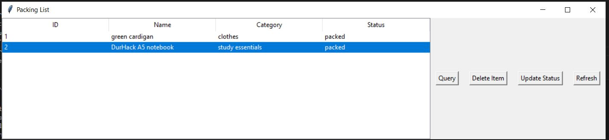
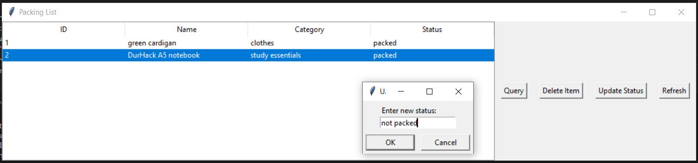
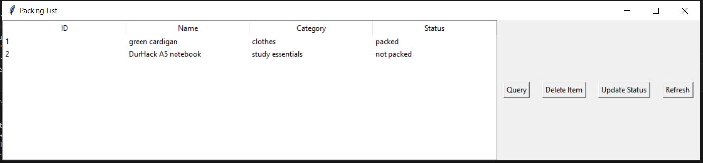
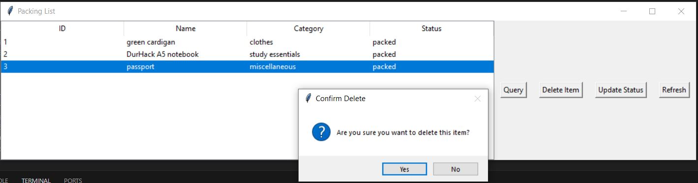
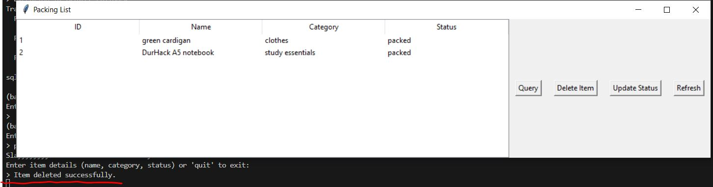
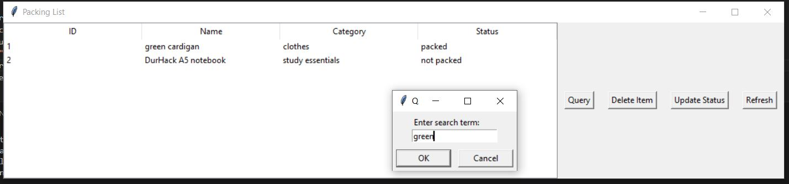
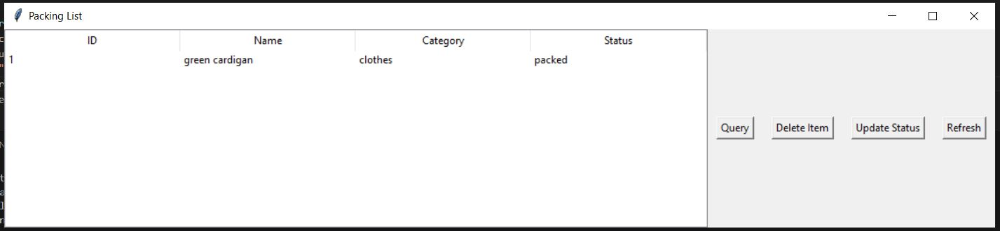

**MOTIVATION**

As the description for this repo says, I'm currently packing to go home for the Chrristmas holidays. 
I have a lot to pack and making an extensive list in the notes section of my phone is inefficient and unorganised.

This is a simple Python database (made using sqlite3) to log everything I'm packing. The system uses tkinter for a simple GUI (and threading to allow for terminal inputs while the GUI is running).

**VERSIONS**
Python 3.8+
SQLite3 module version: 2.6.0
SQLite database version: 3.43.1

**COMMANDS**

When running the file, the program has 3 options:

Insert:

  
   

Update:

First select the item whose status you'd like to update.
  
Change the status via the message box
  
Pressing OK immediately updates the status in the database
  

Delete:

First select the item whose status you'd like to delete.
  
A warning message box is shown.
  
Pressing OK immediately deletes the item in the database and this is seen in the terminal.
  

For both delete and update, if an item is not selected, a message box saying that an item has not been selected.

Query:

Pressing query allows you to search for items. You can query by any column - name, catergoy, or status
  
Pressing OK shows the rows matching the query
  
Pressing refresh return the database back to its initial view
  

